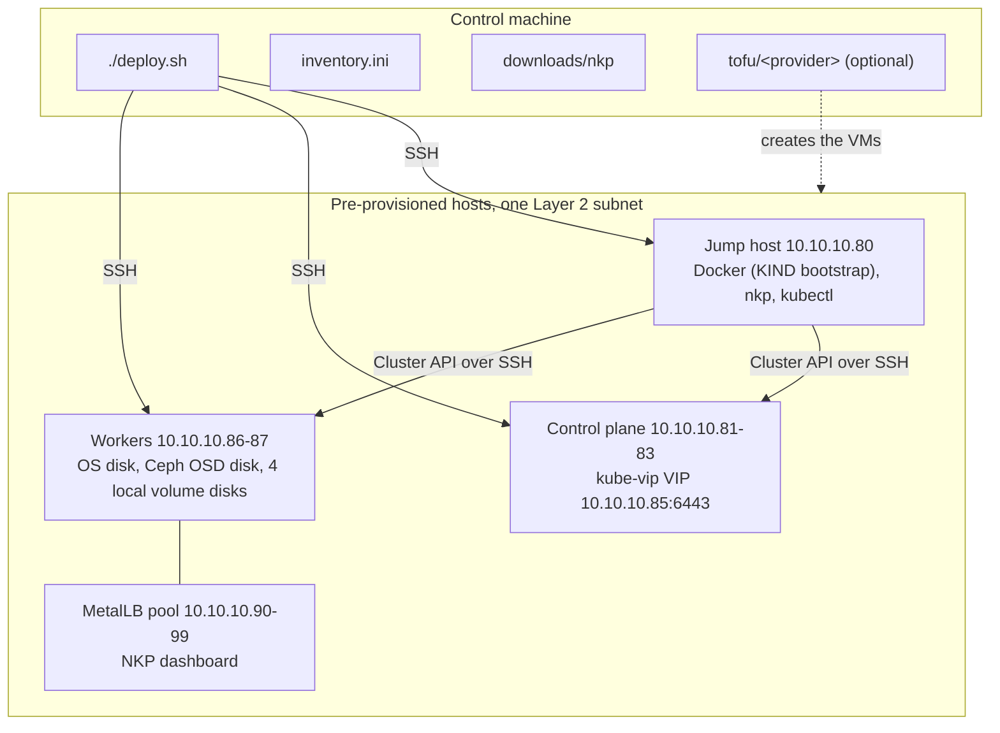

# NKP Preprovisioned Toolkit

[](https://github.com/marco-fabbri/nkp-preprovisioned-toolkit/actions/workflows/ci.yml)
[](LICENSE)
[](#requirements)
[](#os-profile)
[](ansible/)
[](tofu/README.md)

Ansible and bash automation that installs **Nutanix Kubernetes Platform (NKP) 2.18**
on **pre-provisioned** hosts: existing virtual machines or bare-metal servers, on any
hypervisor, that you have already installed with Rocky Linux 9 or Ubuntu 24.04 LTS.
Optional **OpenTofu** modules can create those hosts for you on **Proxmox VE, Nutanix
AHV, VMware ESXi or vSphere**, with the disk layout NKP expects (see
[Provisioning the hosts with OpenTofu](#provisioning-the-hosts-with-opentofu-optional)).

> [!IMPORTANT]
> **Independent project.** This toolkit is not affiliated with, endorsed by or
> supported by Nutanix. Nutanix, NKP and related names are trademarks of Nutanix, Inc.
> Kubernetes is a trademark of The Linux Foundation.
>
> **No Nutanix software, documentation or licence is distributed here.** You obtain
> the NKP CLI from the Nutanix Support Portal under your own entitlement, and you are
> responsible for complying with the Nutanix licence terms.
>
> The toolkit is aimed at labs and proofs of concept and is provided "as is", without
> warranty (see [License](#license)).

## What it does

`./deploy.sh install` runs `ansible/site.yml`, which goes through these stages:

| Stage | Tag | Hosts | What happens |
|---|---|---|---|
| 0 | `preflight` (always runs) | all | Inventory, NKP CLI checksums, OS, sizing, worker data disks (Ceph and local volume disks: present, raw, large enough), address overlap, VIP and port 6443 checks |
| 1 | `jump_host` | jump host | Docker CE, `kubectl`, the NKP CLI, SSH key pair used by Cluster API |
| 2 | `node_prep` | cluster nodes | SSH key, swap off, kernel modules, sysctl, packages, local volume disks formatted and mounted under `/mnt/disks/` on the workers, firewall rules only if a firewall is already active, SELinux permissive on Rocky |
| 2.5 | `cis` | all | Only with a `-cis` profile: apply and audit the [CIS Level 1 aligned baseline](#cis-level-1-aligned-baseline) |
| 3 | `cluster_deploy` | jump host | `nkp create cluster preprovisioned --self-managed` with kube-vip; kubeconfig fetched to the repository root |
| 4 | `storage_network` | jump host, workers | MetalLB Layer 2 address pool; the Rook Ceph OSD device on each worker (raw disk or loop device) |
| 5 | `kommander_deploy` | jump host | Generates `~/nkp/kommander.yaml` (Ceph in host storage mode), `nkp install kommander`, Cluster UUID and licence status, summary banner |

Two gates stop the whole run when any host failed or was unreachable: one after
Stage 0, before any host is changed, and one before Stage 3, so the cluster is never
created with a host that failed its preparation or the CIS audit. Both run with every
`--tags` selection. To work around a host that is down, leave it out explicitly with
`--limit '!<host>'`.

Day-2 commands add or remove a worker through Cluster API
(see [Day-2: scaling workers](#day-2-scaling-workers)). The hosts themselves can
come from anywhere; the optional OpenTofu modules in `tofu/` create them with the
expected layout (see
[Provisioning the hosts with OpenTofu (optional)](#provisioning-the-hosts-with-opentofu-optional)).



## Requirements

### Hosts

All hosts run the same OS, x86_64: **Rocky Linux 9** or **Ubuntu 24.04 LTS**. The
preflight stage rejects anything else.

You create and size the machines; the toolkit only verifies them, against the Pro and
Ultimate requirements of the NKP 2.18 guide:

| Role | Each host | Hosts |
|---|---|---|
| Jump host | 4 vCPU, 8 GiB, 50 GB disk | exactly 1 |
| Control plane | 4 vCPU, 16 GiB, about 80 GB disk | 1, 3 or 5 (3 or 5 for an etcd quorum) |
| Worker | 8 vCPU, 32 GiB, about 80 GB OS disk plus the data disks of [Worker disks](#worker-disks) | at least 1; the guide lists 4 |

- **Pre-provisioned infrastructure requires an NKP Pro or Ultimate licence** (see
  [Licensing](#licensing)), so these are the requirements that apply. For production
  the guide asks for at least three control plane nodes and four workers.
- Fewer workers than the guide lists only produce a warning; at least one is required.
- The RAM check uses thresholds slightly below the nominal size (for example 30000 MB
  for 32 GiB), because the OS reports less memory than is assigned to a VM.
- A smaller lab may lower single thresholds knowingly (`preflight_*_min_vcpus`,
  `preflight_*_min_mem_mb`, `preflight_recommended_workers`, see
  `ansible/roles/preflight/defaults/main.yml` and [Optional variables](#optional-variables)): the
  installation may still work, but the platform applications may not have the
  resources they ask for.
- Every host has the user set in `ansible_user`, reachable with your SSH key and with
  **passwordless sudo**. Logging in as `root` is not supported with the `-cis` profiles.

#### Worker disks

Each worker carries the disk layout of the NKP 2.18 guide; the toolkit never
partitions a disk.

| Disk | Default device | Size | Purpose |
|---|---|---|---|
| OS | the disk holding `/` | about 80 GB | operating system |
| Ceph OSD | `ceph_osd_device` = `sdb` | at least 40 GiB (50 GB suggested) | Rook Ceph in host storage mode, one OSD per worker; the NKP defaults expect four |
| Local volumes | `local_volume_devices` = `sdc`, `sdd`, `sde`, `sdf` | more than 100 GiB each (`local_volume_min_gib`) | local volume provisioner (`localvolumeprovisioner` StorageClass), one volume per disk under `/mnt/disks/vol1..vol4`; Prometheus alone claims a 100 GiB volume |

**How to name the disks.** `ceph_osd_device` and each entry of
`local_volume_devices` accept two forms, and must designate the same disk on
every worker:

- a kernel name without `/dev/`: `sdb`;
- an absolute path: `/dev/disk/by-id/...`, `/dev/disk/by-path/...` or `/dev/sdb`.

Use `/dev/disk/by-id` paths (`ls -l /dev/disk/by-id/` and
`lsblk -o NAME,SIZE,SERIAL` on a worker show them). Kernel names follow the order
in which the kernel detects the disks, not the hypervisor slot, and can change at
the next boot. On a lab worker created by `tofu/proxmox` the disks came up as
`sda` = OS (scsi0), `sdb` = 110 GB local volume disk `nkp-vol1` (scsi2), `sdc` =
50 GB Ceph disk `nkp-ceph` (scsi1): with the defaults `sdb` / `sdc..sdf`, Ceph
would have been pointed at a local volume disk and volume 1 at the Ceph disk. The
by-id links are derived from the disk identity (here the serial number), so they
stay put:

```ini
ceph_osd_device = /dev/disk/by-id/scsi-SQEMU_QEMU_HARDDISK_nkp-ceph
local_volume_devices = ["/dev/disk/by-id/scsi-SQEMU_QEMU_HARDDISK_nkp-vol1", "/dev/disk/by-id/scsi-SQEMU_QEMU_HARDDISK_nkp-vol2", "/dev/disk/by-id/scsi-SQEMU_QEMU_HARDDISK_nkp-vol3", "/dev/disk/by-id/scsi-SQEMU_QEMU_HARDDISK_nkp-vol4"]
```

The defaults stay `sdb` and `sdc`..`sdf` for compatibility with existing
inventories; the preflight prints a warning when kernel names are used. Whatever
the form, every value is resolved on each worker to the kernel name of its disk
(`readlink -f`, read-only) before preflight, OS preparation, the Ceph check of
Stage 4, `tofu-verify` and the `remove-worker` clean-up use it, and the run stops
with the host and the value in the message when a value resolves to no whole disk,
when two values resolve to the same disk, or when a value resolves to the disk
holding `/`. A path makes Rook Ceph select the disk with `devicePathFilter`
(matched against the `/dev/disk/by-*` links of each device), a kernel name with
`deviceFilter`. Local volume N is always the N-th entry of `local_volume_devices`,
whatever its kernel name at a given boot, and it is mounted by file system UUID.

- **Ceph OSD disk.** A raw disk with no partitions, no partition table (a disk once
  initialised with `gdisk` or `parted` is refused by Ceph even when empty: clear it
  with `wipefs --all` or `sgdisk --zap-all`) and no file system. Preflight checks
  the disk, the size and the signatures on every worker; Stage 4 checks the
  signature again against the cluster state. OSDs are placed on worker nodes only.
- **Local volume disks.** A disk without a file system is formatted whole with
  `local_volume_fstype` (`xfs`) and mounted by UUID through `/etc/fstab`
  (`defaults,noatime,nofail`) at `local_volume_mount_prefix<N>`, N being its
  position in the list; a disk that already carries that file system is left
  untouched, so the stage can be run again. A disk with a foreign file system, a
  partition table or another mount point stops the run with a message: the toolkit
  never erases it. Give these disks headroom above 100 GiB (for example 110 GB):
  the provisioner reports the file system size, which is a little smaller than the
  disk, and a volume of exactly 100 GiB cannot satisfy the 100 GiB Prometheus
  claim. Preflight warns when a disk measures exactly `local_volume_min_gib`.
- **Lab shortcuts (opt-in).** Both can be switched off independently in
  `inventory.ini`; they are adequate for a lab, not for data you care about:
  - `ceph_osd_device = ""`: a 50 GB sparse image file (`/var/lib/ceph-osd.img`) on
    the worker root disk, attached as `/dev/loop100`.
  - `local_volume_devices = []`: ten directories of the root filesystem
    (`/var/local-disks/vol1..vol10`) bind-mounted under `/mnt/disks/` on every
    node. The filesystem that holds `/var/local-disks` (the root filesystem, or
    `/var` when it is a separate filesystem) then needs at least 120 GB, because
    every volume reports its size and Prometheus asks for 100 GiB; the preflight
    checks it (`preflight_worker_min_root_fs_gib`, default 105). In loop device mode
    the Ceph image lives on the same filesystem.

  Clusters built with earlier revisions of this toolkit used both shortcuts by
  default: before running `install` or a Day-2 command on such a cluster, set
  `ceph_osd_device = ""` and `local_volume_devices = []` in `inventory.ini`, or the
  preflight fails looking for disks that do not exist.

### Network

- All hosts in one Layer 2 subnet (example: `10.10.10.0/24`).
- One unused address for the control plane VIP (example: `10.10.10.85`), outside the
  MetalLB pool. kube-vip binds it on the interface named in `virtual_ip_interface`:
  check the name with `ip -br a` on a control plane node. The virtual switch must
  let the VMs answer ARP for addresses the hypervisor did not assign to them (on AHV
  and Proxmox: no IP/MAC filtering on these NICs). kube-vip and MetalLB answer with
  the VM's own MAC, so the default security policy of a VMware standard vSwitch
  should allow it; this was not verified (the lab vSwitch accepted promiscuous mode,
  MAC changes and forged transmits for nesting). `./deploy.sh tofu-verify` tests the
  path on your network.
- A range of unused addresses for MetalLB (example: `10.10.10.90-10.10.10.99`). No
  host or VIP address may be inside the range.
- Host, VIP and MetalLB addresses must not fall inside the Pod CIDR
  (`192.168.0.0/16`) or the Service CIDR (`10.96.0.0/12`). Preflight stops if they
  do. Change the addresses, or set `pod_cidr` / `service_cidr` **before** the cluster
  is created.
- Internet access: the jump host downloads Docker CE and `kubectl`; the nodes pull
  OS packages and container images. Air-gapped installation is not covered.
- DNS servers that answer from the node subnet (`dns_servers` of the OpenTofu
  modules, or the resolvers of hosts you created yourself): package and image pulls
  need name resolution. A resolver listed but unreachable from that subnet only
  slows Linux hosts down when a later one answers, but appliances that use only the
  first ones fail.
- Host firewalls: see [Host firewalls on cluster nodes](#host-firewalls-on-cluster-nodes).
  If a firewall sits between the hosts, see the port list in the NKP documentation.

### Host firewalls on cluster nodes

The NKP 2.18 guide lists this among the prerequisites of pre-provisioned control
plane and worker machines: *"firewalld systemd service is disabled"* (stop and
disable it if it is enabled). The guide does not mention UFW; the toolkit treats
Ubuntu the same way, because the reason is the same (a host firewall filters the
traffic of the CNI and of kube-proxy).

- **Default, every profile: the toolkit never installs or enables a firewall on a
  cluster node.** This includes the `-cis` profiles, where control 9 of the baseline
  is reported as *not applied by design* on cluster nodes.
- To comply with the guide, disable the firewall on the nodes before the
  installation: `sudo systemctl disable --now firewalld` (Rocky 9 enables it by
  default) or `sudo ufw disable`.
- A firewall that is **already active** on a node is not stopped: the toolkit prints
  a notice, trusts the node subnet and the Pod CIDR as **sources**, allows SSH (the
  port Ansible connects to) and, on Rocky, sets masquerading in the default zone
  according to `node_firewalld_masquerade` (`true` enables it, `false` disables it).
  It does not open individual ports. This setup is **outside the vendor
  prerequisites** and has not been validated by Nutanix.
- Opt-in: `cis_firewalld_on_nodes = true` (Rocky) or `cis_ufw_on_nodes = true`
  (Ubuntu) with a `-cis` profile makes the baseline install, configure and enable
  the firewall on the nodes too, and the audit then checks it. Also outside the
  vendor prerequisites: use it only if your policy requires a host firewall and
  after testing your workloads.
- The jump host is not a cluster node: with a `-cis` profile it always gets its
  firewall (default deny, SSH allowed).

### Control machine

- Linux or macOS with a current Ansible release (developed with ansible-core 2.21)
  and an SSH key authorised on every host.
- The Ansible collections in `requirements.yml`; `deploy.sh` installs them when
  missing.
- macOS only: the Python `passlib` library in the Python environment used by
  Ansible (needed to hash `vm_default_password`). `./deploy.sh check` stops with
  the install command when it is missing.

### NKP CLI

Download the NKP v2.18.0 CLI for **Linux amd64** from the Nutanix Support Portal and
save the executable as `downloads/nkp` (details in
[downloads/README.md](downloads/README.md)). Preflight verifies its MD5 and SHA-256
against `nkp_binary_md5` and `nkp_binary_sha256` in the inventory.

The checksums in `inventory.example.ini` were computed by the author on the v2.18.0
linux/amd64 CLI. The authoritative values are those published by Nutanix; update the
two variables for any other build.

## Provisioning the hosts with OpenTofu (optional)

The toolkit installs NKP on hosts that already exist, however they were created. The
`tofu/` directory holds optional [OpenTofu](https://opentofu.org/) modules that create
such hosts, one directory per virtualisation provider, all implementing one contract
so that the Ansible part never knows which provider made the VMs. Details, provider
notes and the contract are in [tofu/README.md](tofu/README.md).

| Module | Platform | Status |
|---|---|---|
| `tofu/proxmox/` | Proxmox VE 8.2+ (bpg/proxmox provider) | validated with a full NKP installation |
| `tofu/nutanix/` | Nutanix AHV through Prism Central pc.2024.3+ (nutanix/nutanix provider) | validated with `tofu-verify` only |
| `tofu/esxi/` | standalone ESXi 7.0 U2+, free licence included (SSH, no provider) | validated with `tofu-verify` only |
| `tofu/vsphere/` | vCenter 7.0+ (hashicorp/vsphere provider) | validated with `tofu-verify` only |

Details are in [Known limitations / validation status](#known-limitations--validation-status).

### The contract

Every module takes the same inputs (`os_distribution` = `rocky9` or `ubuntu24`,
`sizing_profile`, `jump_host_ip`, `control_plane_ips` with 1 or 3 addresses,
`control_plane_vip`, `worker_ips`, `network_gateway`, `network_prefix_length`,
`dns_servers`, `ssh_public_key`, `vm_user`, plus the provider's endpoint, credentials
and datastore) and creates one jump host, the control plane nodes and one worker per
address in `worker_ips`, from the Rocky Linux 9 or Ubuntu 24.04 cloud image, with
static addresses and a `vm_user` (default `nutanix`) that accepts `ssh_public_key` and
has passwordless sudo. Workers get the disk layout of [Worker disks](#worker-disks);
nothing is partitioned, formatted or mounted by the module.

| Disk | SCSI slot | Purpose |
|---|---|---|
| 1 | 0 | operating system |
| 2 | 1 | raw Ceph OSD disk (`ceph_osd_device`) |
| 3-6 | 2..5 | local volumes 1..4 (`local_volume_devices`) |

The kernel names of these disks do not follow the slot order (see
[Worker disks](#worker-disks)): the generated inventory names them by a stable
link that reads the same on every worker. On Proxmox it is the serial the module
sets (`/dev/disk/by-id/scsi-SQEMU_QEMU_HARDDISK_nkp-ceph`, `..._nkp-vol1` to
`..._nkp-vol4`); AHV, ESXi and vSphere do not let a module choose a disk serial, so
their modules use the `/dev/disk/by-path` link of the SCSI slot. The values per provider
are in [tofu/README.md](tofu/README.md#stable-disk-paths).

The outputs are the addresses and `ansible_inventory`, an `inventory.ini` snippet with
the host groups and an `[all:vars]` stub that carries every variable the preflight
requires: `ansible_user`, `os_profile`, `cluster_name` (`nkp-cluster`),
`control_plane_vip`, `virtual_ip_interface` with the NIC name the guest gets on that provider,
an example `metallb_ip_range` (`10.10.10.90-10.10.10.99`, marked as such because the
module cannot know which addresses are free), `ceph_osd_device` and
`local_volume_devices` (the stable links above) and `tofu_sizing_profile` (read by `deploy.sh`, ignored by Ansible). The snippet passes
`tofu-verify` as it is; before `install` the MetalLB pool must be replaced and the NKP
CLI path and checksums of `inventory.example.ini` added by hand.

### Sizing profiles

`sizing_profile` selects the VM sizes. `pro-ultimate` (the default) follows the Pro and
Ultimate requirements of [Hosts](#hosts), the sizes the preflight checks;
`contract-test` creates VMs far below the NKP minimums, meant only to exercise a
provider module with `tofu-verify`, which skips the size thresholds.

| `sizing_profile` | Control plane | Worker | OS disk | Ceph disk | Local volumes | Jump host |
|---|---|---|---|---|---|---|
| `pro-ultimate` | 4 vCPU / 16384 MB | 8 vCPU / 32768 MB | 80 GB | 50 GB | 4 x 110 GB | 4 vCPU / 8192 MB / 50 GB |
| `contract-test` | 2 vCPU / 2048 MB | 2 vCPU / 2048 MB | 20 GB | 5 GB | 4 x 5 GB | 2 vCPU / 2048 MB / 20 GB |

The guide lists 3 control plane nodes and 4 workers; the module creates one worker per
address and never enforces the count. The local volume disks get 110 GB, the headroom
above 100 GiB described in [Worker disks](#worker-disks). `ceph_disk_size_gb` and
`local_volume_size_gb` override the disk sizes of either profile.

### Commands

```bash
export TOFU_PROVIDER=proxmox               # or nutanix, esxi, vsphere
cp tofu/$TOFU_PROVIDER/terraform.tfvars.example tofu/$TOFU_PROVIDER/terraform.tfvars
chmod 600 tofu/$TOFU_PROVIDER/terraform.tfvars   # endpoint, credentials, placement, network, addresses, key
./deploy.sh tofu-init
./deploy.sh tofu-plan
./deploy.sh tofu-apply                     # OpenTofu asks for confirmation
tofu -chdir=tofu/$TOFU_PROVIDER output -raw ansible_inventory > inventory.ini
chmod 600 inventory.ini                    # then replace the MetalLB pool, add the NKP CLI checksums
./deploy.sh tofu-verify                    # contract test of the created VMs
./deploy.sh install
./deploy.sh tofu-destroy                   # OpenTofu asks for confirmation
```

The `tofu-*` commands need OpenTofu on the control machine and run in
`tofu/<provider>/`; the provider is `TOFU_PROVIDER`, else `tofu_provider` in
`inventory.ini`, else `proxmox`; plan and apply of `esxi` and `vsphere` also need
`qemu-img`, `curl` and an ISO tool (`hdiutil`, `xorriso` or `genisoimage`) on the
control machine, plus `ssh`/`scp` for `esxi` and `python3` for `vsphere`, which
`deploy.sh` checks first. When `inventory.ini` exists, `tofu-plan`,
`tofu-apply` and `tofu-destroy` pass `-var=os_distribution` derived from `os_profile`
(`rocky*` -> `rocky9`, `ubuntu*` -> `ubuntu24`), so the VMs run the OS the Ansible roles
check, and `-var=sizing_profile` from the optional key `tofu_sizing_profile`
(`pro-ultimate` when absent). Extra arguments go to OpenTofu after those and override
them: `./deploy.sh tofu-apply -var=sizing_profile=contract-test` creates contract-test
VMs before any `inventory.ini` exists, and the generated inventory then records
`tofu_sizing_profile = contract-test` so that `tofu-plan` and `tofu-destroy` keep using
it.

### `tofu-verify`: the contract test

`./deploy.sh tofu-verify` runs `ansible/verify_hosts.yml` with `inventory.ini` and
`-e preflight_skip_sizing=true`. It installs no package and changes nothing persistent
on the hosts; the NKP CLI is not needed. It checks:

- SSH and sudo access, then the preflight role with the vCPU, RAM and disk size
  thresholds skipped (a warning reminds that NKP must not be installed on hosts that
  only pass this way);
- on every worker: the Ceph disk and every local volume disk exist and reach
  `contract_ceph_min_gib` / `contract_local_volume_min_gib` (1 GiB by default,
  because the `contract-test` disks are below the NKP minimums);
- on the control plane nodes: `virtual_ip_interface` exists;
- cloud-init has finished on every host;
- the layer-2 path of the VIP: `control_plane_vip/32` is added to
  `virtual_ip_interface` of the first control plane node, pinged three times from a
  worker and always removed again. A failure names the virtual switch settings that
  block kube-vip and MetalLB. The test is skipped when the preflight treats the
  cluster as existing: a non-empty `<cluster_name>.conf` in the repository root
  or `~/nkp/<cluster_name>.conf` on the jump host, or
  `preflight_assume_existing_cluster=true`. Remove those kubeconfigs when the
  hosts were rebuilt.

It ends with a summary and exits non-zero when any host failed. It does **not**
validate the NKP size requirements (that is `./deploy.sh check` without
`preflight_skip_sizing`), the storage performance, the MetalLB pool, internet
reachability or the installation itself: a passing `tofu-verify` proves that the
module delivers the agreed layout, not that NKP will install.

### What is validated

On Proxmox the module is validated with a full installation. The Nutanix AHV,
ESXi and vSphere modules are validated with `tofu-verify` only, on hosts too small
for an NKP installation. See
[Known limitations / validation status](#known-limitations--validation-status).
Hosts created by hand or by any other tool are checked the same way by the preflight
stage.

## Quick start

```bash
cp inventory.example.ini inventory.ini
chmod 600 inventory.ini
vim inventory.ini          # addresses, os_profile, VIP, interface, MetalLB range, disks

./deploy.sh ping           # SSH and sudo on every host
./deploy.sh check          # preflight only
./deploy.sh install        # full installation
```

Useful variants:

```bash
./deploy.sh install --tags kommander_deploy   # one stage (preflight and the gates always run too)
./deploy.sh install -v                        # options go to ansible-playbook
./deploy.sh help
```

`install` can be run again: stages that are already done are skipped or report no
change. The kubeconfig is saved on the jump host (`/home/<ansible_user>/nkp/<cluster_name>.conf`)
and copied to the repository root as `<cluster_name>.conf` (mode 0600, gitignored):

```bash
export KUBECONFIG=$PWD/nkp-cluster.conf
kubectl get nodes -o wide
```

### If cluster creation fails

`nkp create cluster` failures stop the playbook and print the last lines of the
error. The KIND bootstrap container is left on the jump host for diagnosis. Before
running `install` again:

1. On the jump host, run `nkp delete bootstrap`.
2. Reset or rebuild the nodes that were already initialised. On a reset worker also
   clear the Ceph device, which otherwise carries the signature of the previous
   cluster and is silently skipped by Rook (Stage 4 refuses it): raw disk,
   `wipefs --all <disk>` (`ceph_osd_device`, or `/dev/` followed by it for a kernel
   name; check with `lsblk` that it is the right disk), then zero the BlueStore
   label copies that Ceph 19 keeps at 0, 1, 10, 100 and 1000 GiB, which `wipefs`
   does not remove (`for off in 0 1024 10240 102400 1024000; do dd if=/dev/zero
   of=<disk> bs=1M count=1 seek=$off oflag=direct conv=notrunc; done`, each
   offset only if it fits on the disk); loop device,
   `systemctl disable --now attach-ceph-loop && losetup -d /dev/loop100 && rm /var/lib/ceph-osd.img`;
   in both cases `rm -rf /var/lib/rook`. The local volume disks keep their file
   systems and are reused as they are: delete their content under `/mnt/disks/volN`
   if you want empty volumes.
3. Remove the kubeconfig on the jump host if one was written.

If a kubeconfig exists but the Cluster API `Cluster` object cannot be read through
it, the `cluster_deploy` stage stops without changing anything.

## Configuration

All settings live in `inventory.ini` (groups `jump_host`, `control_plane`, `workers`,
and `nkp_nodes` as parent of the last two). Scalar settings can also be passed with
`-e name=value`; a list (`local_volume_devices`, `cis_extra_trusted_cidrs`) needs the
JSON form, `-e '{"cis_extra_trusted_cidrs": ["10.20.0.0/24"]}'`, and is written the
same way, on one line, in `inventory.ini`
(`local_volume_devices = ["/dev/disk/by-id/...-vol1", "/dev/disk/by-id/...-vol2"]`).

### OS profile

| `os_profile` | Operating system | Stage 2.5 |
|---|---|---|
| `rocky` | Rocky Linux 9 | skipped |
| `ubuntu` | Ubuntu 24.04 LTS | skipped |
| `rocky-cis` | Rocky Linux 9 | CIS Level 1 aligned baseline (subset of controls), applied and audited |
| `ubuntu-cis` | Ubuntu 24.04 LTS | CIS Level 1 aligned baseline (subset of controls), applied and audited |

Preflight checks that every host really runs the declared distribution.

### Required variables

| Variable | Example | Purpose |
|---|---|---|
| `os_profile` | `rocky` | See above |
| `ansible_user` | `nutanix` | OS user on every host |
| `cluster_name` | `nkp-cluster` | Cluster name; also the kubeconfig file name |
| `control_plane_vip` | `10.10.10.85` | kube-vip address of the Kubernetes API |
| `virtual_ip_interface` | `eth0` | Interface on the control plane nodes that carries the VIP |
| `metallb_ip_range` | `10.10.10.90-10.10.10.99` | MetalLB Layer 2 pool |
| `nkp_binary_local_path` | `downloads/nkp` | NKP CLI, relative to the repository root |
| `nkp_binary_md5`, `nkp_binary_sha256` | see example | Expected checksums of the NKP CLI |

### Optional variables

| Variable | Default | Purpose |
|---|---|---|
| `vm_default_password` | `nutanix/4u` | Password set for `ansible_user` on every host. Empty: password left untouched |
| `ssh_password_authentication` | `true` | Written to the sshd drop-in `01-nkp-password-auth.conf`: `true` sets `PasswordAuthentication yes`, `false` sets `PasswordAuthentication no` |
| `node_subnet_cidr` | subnet of each host's default-route interface | Node subnet trusted by the host firewall rules |
| `node_firewalld_masquerade` | `true` | Rocky nodes where firewalld runs: masquerading in the default zone, enabled (`true`) or disabled (`false`). Any profile. `cis_firewalld_masquerade` is still accepted as an alias |
| `cis_firewalld_on_nodes`, `cis_ufw_on_nodes` | `false`, `false` | `-cis` profiles: install and enable firewalld (Rocky) / UFW (Ubuntu) on cluster nodes. Outside the vendor prerequisites, see [Host firewalls on cluster nodes](#host-firewalls-on-cluster-nodes) |
| `pod_cidr` | `192.168.0.0/16` | Pod network, passed to `nkp create cluster`; trusted by the host firewall rules |
| `service_cidr` | `10.96.0.0/12` | Service network, passed to `nkp create cluster` |
| `kubectl_version` | `v1.35.2` | `kubectl` client installed on the jump host |
| `cluster_ssh_user` | `ansible_user` | User that Cluster API uses to reach the nodes |
| `cluster_ssh_key_path` | `/home/<ansible_user>/.ssh/id_rsa` | Key pair on the jump host used by Cluster API; created when missing, never overwritten. Literal absolute path. For a new installation a dedicated key such as `/home/<ansible_user>/.ssh/nkp_cluster_key` is recommended |
| `nkp_user_home` | `/home/<ansible_user>` | Home directory of `ansible_user` |
| `nkp_workdir` | `<nkp_user_home>/nkp` | Working directory on the jump host |
| `cluster_kubeconfig` | `<nkp_workdir>/<cluster_name>.conf` | Kubeconfig on the jump host |
| `nkp_nodepool_name` | `md-0` | Worker node pool name (the one created by the NKP CLI; do not change) |
| `cluster_deploy_create_timeout_minutes` | `150` | Time allowed to `nkp create cluster` (about 40 minutes on Ubuntu and more than 70 on Rocky in a lab) |
| `preflight_assume_existing_cluster` | `false` | Skip the "VIP unused" and "port 6443 free" checks |
| `preflight_control_plane_min_vcpus`, `preflight_control_plane_min_mem_mb` | `4`, `15000` | Size thresholds of each control plane node (Pro and Ultimate requirements, see [Hosts](#hosts)); lower a single value knowingly for a smaller lab |
| `preflight_worker_min_vcpus`, `preflight_worker_min_mem_mb` | `8`, `30000` | Size thresholds of each worker |
| `preflight_jump_host_min_vcpus`, `preflight_jump_host_min_mem_mb` | `4`, `7500` | Size thresholds of the jump host |
| `preflight_recommended_workers` | `4` | Workers listed by the guide; fewer only produce a warning |
| `preflight_skip_sizing` | `false` | `true` skips the vCPU, RAM and disk size thresholds of the preflight (every other check still runs) and prints a warning that NKP must not be installed on such hosts. Set by `./deploy.sh tofu-verify` |
| `preflight_check_nkp_binary` | `true` | `false` skips the existence and checksum checks of the NKP CLI (`ansible/verify_hosts.yml` sets it) |
| `preflight_cloud_init_timeout` | `1200` | Seconds to wait for cloud-init to finish its first boot on each host |
| `ceph_osd_device` | `sdb` | Raw disk each worker gives to Rook Ceph: kernel name without `/dev/` or absolute path, `/dev/disk/by-id/...` recommended (kernel names can change at boot, the preflight warns); `""` = loop device lab shortcut, see [Worker disks](#worker-disks) |
| `local_volume_devices` | `["sdc", "sdd", "sde", "sdf"]` | Disks each worker gives to the local volume provisioner, same forms as `ceph_osd_device`, volume N = N-th entry; `[]` = directory lab shortcut (vol1..vol10 bind-mounted on every node) |
| `local_volume_min_gib` | `100` | Minimum size of each local volume disk checked by the preflight |
| `local_volume_fstype` | `xfs` | File system created on a blank local volume disk; the only one accepted on a disk that already has one |
| `local_volume_mount_prefix` | `/mnt/disks/vol` | Mount points `<prefix>1..N`; its directory (`/mnt/disks`) is the discovery directory of the provisioner |
| `preflight_worker_min_root_fs_gib` | `105` | Directory shortcut only: minimum size of the filesystem holding `/var/local-disks` |
| `storage_network_ceph_image_path` | `/var/lib/ceph-osd.img` | Loop device shortcut: image file behind the Ceph loop device |
| `storage_network_ceph_image_size` | `50G` | Size of that file, applied when it is first created |
| `tofu_provider` | `proxmox` | Directory under `tofu/` used by the `tofu-*` commands of `deploy.sh`: `proxmox`, `nutanix`, `esxi` or `vsphere` (read from `inventory.ini`, not by Ansible) |
| `tofu_sizing_profile` | `pro-ultimate` | `sizing_profile` passed by the `tofu-*` commands of `deploy.sh`: `pro-ultimate` or `contract-test` (read from `inventory.ini`, not by Ansible); the generated inventory records the profile the VMs were created with |
| `node_prep_remove_legacy_konvoy_user` | `true` | Remove the `konvoy` account created by earlier revisions of this toolkit |
| `kommander_deploy_installer_overrides` | `{}` | Customisations merged last into the generated `kommander.yaml`, see [Kommander installer configuration](#kommander-installer-configuration) |
| `cis_extra_trusted_cidrs`, `cis_audit_strict` | `[]`, `true` | `-cis` profiles only, see [cis/README.md](cis/README.md) |

The shared defaults are in `ansible/roles/common/defaults/main.yml`.

### How the nodes are accessed

1. The `jump_host` stage generates an RSA 4096 key pair on the jump host
   (`cluster_ssh_key_path`) when the file does not exist. An existing key is kept;
   if it is not an RSA 4096 key without passphrase (for example a personal
   `~/.ssh/id_rsa` of another type or size) the stage **stops instead of
   overwriting it**: point `cluster_ssh_key_path` to a dedicated file such as
   `/home/<ansible_user>/.ssh/nkp_cluster_key`. Do not change the path of an
   existing cluster: Cluster API keeps using the key it was created with.
2. The `node_prep` stage reads the public key from the jump host and authorises it
   for `cluster_ssh_user` on every node.
3. `nkp create cluster preprovisioned` is run with that key and user.

### Kommander installer configuration

Stage 5 writes `~/nkp/kommander.yaml` on the jump host from
`nkp install kommander --init` plus the Rook Ceph host storage settings, and runs
`nkp install kommander --installer-config` with it. **The file is regenerated on every
run**, including `./deploy.sh install --tags kommander_deploy`: hand edits are lost,
and a changed file makes the installer run again. Put customisations (the NKP guide's
custom domain and certificate, HTTP proxy, application toggles) in
`kommander_deploy_installer_overrides`, a dictionary with the layout of the file that
is merged last:

```ini
[all:vars]
# One line, JSON: parsed by the kommander_deploy stage.
kommander_deploy_installer_overrides = {"apps": {"kube-prometheus-stack": {"enabled": false}}}
```

or `-e '{"kommander_deploy_installer_overrides": {"apps": {...}}}'` on the command line.
An override of `apps.rook-ceph-cluster.values` replaces the generated Ceph settings
as a whole (it is one YAML string, not merged): include the host storage settings
again if you override it.

## Licensing

This toolkit does not include, generate, apply or change any NKP licence.

- The cluster starts on the key NKP assigns at installation on non-Nutanix
  infrastructure: tier `Pro`, no licence id, zero cluster and core capacity. The
  management cluster and its platform applications run, the dashboard reports "No
  NKP license activated", and anything that consumes licence capacity (managed
  clusters, cores) is unavailable until you activate your licence. (The NKP guide
  states that this default key must be replaced with the one from the Nutanix
  Support Portal, and that the Starter licence is supported only on Nutanix
  infrastructure: pre-provisioned clusters need Pro or Ultimate.)
- An NKP licence is issued for a **Cluster UUID**: the UID of the Cluster API
  `Cluster` object the NKP CLI creates (the identifier the Nutanix licensing
  knowledge base asks for), which exists only once the cluster has been created.
  The installation therefore prints it in its summary (see
  [After the installation](#after-the-installation)); on the jump host you can
  read it at any time with
  `kubectl --kubeconfig ~/nkp/<cluster_name>.conf get cluster -o jsonpath='{.items[0].metadata.uid}'`.
  It is not the UID of the `kube-system` namespace, which NKP uses for monitoring.
- To activate it: request an NKP Pro or Ultimate licence for that Cluster UUID on the
  Nutanix Support Portal, then in the NKP dashboard select **Global > Settings >
  Licensing > Activate License** and enter the key.
- A cluster created again from scratch has a new Cluster UUID and needs a licence
  issued for it.

## After the installation

The last task prints a summary. With the dashboard address assigned, every Kommander
application Ready and no licence activated yet, it looks like this (example values;
Ansible prints it as a YAML list):

```text
==============================================================================
NKP PREPROVISIONED CLUSTER DEPLOYED SUCCESSFULLY
==============================================================================
Jump Host Access:
  IP: 10.10.10.80
  User: nutanix
  SSH: ssh nutanix@10.10.10.80
------------------------------------------------------------------------------
Control Plane API VIP: https://10.10.10.85:6443
NKP Dashboard: https://10.10.10.90/dkp/kommander/dashboard
Dashboard credentials (run on the jump host): nkp get dashboard --kubeconfig /home/nutanix/nkp/nkp-cluster.conf
Kommander applications: 42 of 42 applications ready
Application status (run on the jump host): kubectl --kubeconfig /home/nutanix/nkp/nkp-cluster.conf -n kommander get helmreleases
Kubeconfig on the jump host: /home/nutanix/nkp/nkp-cluster.conf
------------------------------------------------------------------------------
NKP LICENSE
------------------------------------------------------------------------------
Cluster UUID (UID of the Cluster API cluster object): 0f2a6c1e-8d4b-4c3a-9b7e-5a1d2c3e4f50
License status reported by the cluster: nutanix-license: tier=Pro valid=true licenseId= clusters=0 cores=0
Until a licence is activated the cluster runs on the default key NKP assigns (tier Pro, no license id,
zero capacity) and the dashboard reports that no license is activated. To activate yours:
  1. request an NKP Pro or Ultimate licence for the Cluster UUID above on the Nutanix Support Portal;
  2. in the NKP dashboard select Global > Settings > Licensing > Activate License and enter the key.
This toolkit never applies or changes the licence.
==============================================================================
```

Once a licence is activated in the dashboard, running
`./deploy.sh install --tags kommander_deploy` again reprints the block as:

```text
NKP LICENSE
------------------------------------------------------------------------------
Cluster UUID (UID of the Cluster API cluster object): 0f2a6c1e-8d4b-4c3a-9b7e-5a1d2c3e4f50
License status reported by the cluster: nutanix-license: tier=Ultimate valid=true licenseId= clusters=0 cores=0
An Ultimate licence is activated on this cluster
(the dashboard shows its expiry and core usage under Global > Settings > Licensing).
This toolkit never applies or changes the licence.
==============================================================================
```

The toolkit tells the two states apart by the tier: `Pro` is the key NKP assigns by
default on non-Nutanix infrastructure, any other valid tier was activated. The
`License` resource does not report the licence id, expiry or core usage; the
dashboard does.

Variants:

- Kommander is installed with `--wait=false`, so the playbook usually ends while the
  applications are still starting. The title says `DEPLOYED SUCCESSFULLY` only when
  the dashboard address is assigned **and** every HelmRelease in namespace
  `kommander` reports Ready. Otherwise it is
  `NKP CLUSTER CREATED - KOMMANDER STILL CONVERGING (<n> of <m> applications ready)`
  (or `(application state unknown)` when the query fails), and the dashboard may
  answer 404/503 for a while. Follow the progress with the "Application status"
  command; run `./deploy.sh install --tags kommander_deploy` again to reprint the
  banner.
- If the ingress service has no external address after 10 minutes, the dashboard
  line reports `pending`.
- The licence status line reads `unknown (the license query failed)` or
  `no License resource found in namespace kommander` when that is the case.
- Passwords and dashboard credentials are never printed. Get the
  dashboard credentials with the `nkp get dashboard` command shown in the banner.

If an application stays not ready, check it with the `kubectl ... get helmreleases`
command printed in the banner. A slow start can make Flux mark a release as stalled
and stop retrying; `./deploy.sh install --tags kommander_deploy` resets such
releases and prints the banner again. That run also regenerates `~/nkp/kommander.yaml`
(see [Kommander installer configuration](#kommander-installer-configuration)).

## CIS Level 1 aligned baseline

The `cis/` directory applies and audits a **CIS Level 1 aligned baseline (subset of
controls)** on Rocky Linux 9 and Ubuntu 24.04 LTS: nine groups of controls (kernel
modules, sysctl, auditd / chrony / cron services, auditd rules, file permissions,
account defaults, banners, sshd, host firewall), with the deviations Kubernetes
needs applied to cluster nodes only.

It is **not** a complete or certified implementation of a CIS Benchmark, and a
passing audit does not make a host CIS compliant. The full list of what is applied,
audited and deliberately left out is in [cis/README.md](cis/README.md).

```bash
./deploy.sh cis-harden                          # or ./cis/harden.sh
./deploy.sh cis-audit                           # or ./cis/audit.sh
./deploy.sh cis-audit -e cis_audit_strict=false # report only
```

- With `os_profile = rocky-cis` or `ubuntu-cis`, `./deploy.sh install` runs both in
  Stage 2.5, on all hosts including the jump host, before the cluster is created.
- The audit exits non-zero when a control fails. In Stage 2.5 the report is printed
  for every host, then the gate before Stage 3 stops the installation if any host
  failed the hardening or the audit. `-e cis_audit_strict=false` only prints the
  report.
- **Control 9 (host firewall) is not applied on cluster nodes by default**, because
  the NKP guide requires firewalld to be disabled there; the audit reports it as
  `NOT APPLIED (by design ...)` with the observed firewall state, not as a failure.
  The jump host always gets its firewall. See
  [Host firewalls on cluster nodes](#host-firewalls-on-cluster-nodes).
- With the opt-in (`cis_firewalld_on_nodes` / `cis_ufw_on_nodes`), cluster nodes
  accept traffic only from the node subnet, the Pod CIDR and
  `cis_extra_trusted_cidrs` (plus SSH from anywhere): the Kubernetes API (6443), the
  dashboard and every LoadBalancer or NodePort service are then unreachable from
  other networks unless they are listed there.
- The default password and SSH password authentication are left in place by the
  baseline (see [Security considerations](#security-considerations)).

## Day-2: scaling workers

Both operations go through **Cluster API**: the worker `PreprovisionedInventory` is
edited and the worker `MachineDeployment` is scaled by one with `kubectl` (with
`--current-replicas`, so a pool that changed in the meantime is not scaled twice).
They need the cluster kubeconfig on the jump host. A scale does not name a host:
the provider claims any free address of the inventory, so both commands **check
that the node pool is in a steady state** (as many replicas as hosts, no Machine
left over) and stop without changing anything when it is not. Extra arguments are
passed to `ansible-playbook`.

### Add a worker

```bash
./deploy.sh add-worker --ip 10.10.10.89
./deploy.sh add-worker --ip 10.10.10.89 --name nkp-worker-03
```

1. Validates the address: IPv4, not the VIP, not an existing inventory host, outside
   `metallb_ip_range`.
2. Runs the preflight role on the jump host and the new host (so `downloads/nkp`
   must still be present, and the new host needs the same data disks as the other
   workers), then the same OS preparation as the original workers, including the
   local volume disks. On a `-cis` profile the baseline is applied too; run
   `./deploy.sh cis-audit` afterwards to audit it. **Any failure here stops the run
   before the cluster is touched.**
3. Prepares the Ceph OSD device (raw disk check, or loop device) and tests SSH and
   sudo from the jump host.
4. Checks that the node pool has as many replicas as hosts in its
   `PreprovisionedInventory`; if not, it lists the addresses without a node and
   stops.
5. Adds the address to the `PreprovisionedInventory`, scales the `MachineDeployment`
   by +1 and waits up to 30 minutes for a Ready node with that address
   (`-e day2_wait_timeout=<seconds>`).
6. Restarts the Rook Ceph operator so that the new worker gets an OSD (best effort:
   the report says whether it was restarted), then adds the host under `[workers]`
   in `inventory.ini`.

`--name` sets the OS hostname, which is also the Kubernetes node name; without it
the hostname is left alone and the inventory name is `nkp-worker-<last octet>`. The
new host is reached with the SSH user of the existing workers, because Cluster API
uses one SSH user for the whole node pool.

After a timeout:

- **Continue:** fix the host and run the same command again. It resumes waiting
  without scaling a second time.
- **Roll back:** the address is in the `PreprovisionedInventory` and a Machine is
  waiting for it, so `--cleanup-only` alone is refused. On the jump host
  (`kubectl --kubeconfig <cluster_kubeconfig>`): annotate the Machine that has no
  node with `cluster.x-k8s.io/delete-machine=yes`, scale the `MachineDeployment`
  back to the previous number of replicas, wait until that Machine is gone, then
  run `./deploy.sh remove-worker --cleanup-only --ip <IP>`. The exact commands are
  printed in the failure message.

### Remove a worker

```bash
./deploy.sh remove-worker --name nkp-worker-02     # exact name from "kubectl get nodes"
./deploy.sh remove-worker --ip 10.10.10.87 --yes
```

| Option | Effect |
|---|---|
| `--name` / `--ip` | Exact node name or exact address (one of the two) |
| `--yes`, `-y` | Skip the confirmation (you otherwise type the node name). Required without a terminal |
| `--force` | Proceed even if Rook Ceph is not `HEALTH_OK`. With `--cleanup-only`: also clean a host that is not recognised as a former member of this cluster |
| `--reboot` | Reboot the host at the end of the OS clean-up |
| `--cleanup-only --ip <IP> [--name <node>]` | Skip the drain and scale-in: clean up the OS of a host that already left the cluster. A leftover `PreprovisionedInventory` entry and the `inventory.ini` line of the host are removed too. With `--name` (the name the host had as a node) its down Ceph OSD is purged; without it no purge is attempted. The cluster kubeconfig on the jump host is still required |

1. Guards: control plane nodes, the jump host and the VIP are refused; at least
   `min_workers` (default 2, `-e min_workers=N`) Ready and schedulable workers must
   remain; Rook Ceph must be `HEALTH_OK` unless `--force`; a node without a Cluster
   API `Machine` is refused; the node pool must have as many replicas as Machines
   (no scale or rollout in progress).
2. Marks the `Machine` for deletion and scales the `MachineDeployment` by -1.
   Cluster API cordons, drains (honouring PodDisruptionBudgets) and deletes the node.
3. Purges the Ceph OSD of the node (see below) and removes the address from the
   `PreprovisionedInventory`.
4. Cleans up the host: `kubeadm reset`, the Ceph loop unit and image, `/var/lib/rook`
   and the CNI, kubelet and Kubernetes directories. The configured disks are first
   resolved on the host as in the preflight; a value that resolves to no disk, to
   the same disk as another value or to the disk holding `/` stops the clean-up
   before anything is changed. With `ceph_osd_device` set, the
   Ceph signature is wiped from that disk (`wipefs --all`, then every BlueStore
   label copy that fits on the disk is zeroed, since Ceph 19 keeps copies at 0, 1,
   10, 100 and 1000 GiB), only when it is a whole
   disk without partitions that is blank or carries a Ceph signature; otherwise it is
   left alone and the report says so. Each disk in `local_volume_devices` that is a
   whole disk carrying the `local_volume_fstype` file system, mounted at its own
   mount point or not at all, is unmounted, removed from `/etc/fstab` and wiped; any
   other disk is left alone and reported. The directories of the directory shortcut
   (`/var/local-disks/volN`) are not removed. kubelet and containerd are not
   disabled, so the host can be added again (it then gets fresh local volumes).
5. Removes the host from `inventory.ini` and prints what actually succeeded. The
   command exits non-zero if the OS clean-up failed; finish it with
   `./deploy.sh remove-worker --cleanup-only --ip <IP>`.

If the removal times out (a PodDisruptionBudget blocking the drain is the usual
cause), fix the blocker and:

- if the Machine is still listed, run the same command again: it resumes waiting,
  never scales a second time, and does not enforce the Ceph health guard while the
  Machine is being deleted (Ceph is degraded by that very removal);
- if Cluster API finished on its own and the node is gone, finish with
  `./deploy.sh remove-worker --cleanup-only --ip <IP> --name <node>` (the name purges
  the Ceph OSD the node hosted).

`--cleanup-only` runs `kubeadm reset --force`, deletes directories, wipes the raw
Ceph disk when `ceph_osd_device` is set and the local volume disks when
`local_volume_devices` is not empty, so it refuses:

- a host that is still a node or has a Machine, a control plane node, the jump host
  and the VIP;
- an address that a pending Machine still needs (failed `add-worker`: roll it back
  as described above);
- unless `--force` is given, a host whose kubelet is configured for another API
  endpoint than `control_plane_vip` (it looks like a member of another cluster), and
  a host that is neither a worker of `inventory.ini`, nor listed in the
  `PreprovisionedInventory`, nor carrying traces of this cluster.

After Cluster API has removed the node, the OSDs registered under its CRUSH host
bucket and reported `down` are purged from the Ceph cluster (`ceph osd out`,
`ceph osd purge`, then `ceph osd crush rm` of the host bucket, through the
`rook-ceph-tools` deployment of the first `CephCluster`). An OSD that is still `up`
under that name is never touched. With `--cleanup-only` the node name is no longer
in the cluster, so the purge runs only when `--name` is given. The purge is best
effort: the report prints what was done, and the manual commands when it was not.
`add-worker` restarts the Rook Ceph operator once the node is Ready, so that the new
worker gets an OSD; expect Ceph to report `HEALTH_OK` a few minutes later. Removing a
worker reduces Ceph capacity and redundancy until it is replaced.

Not automated: iptables rules and CNI interfaces are not flushed (reboot the host,
or use `--reboot`, before reusing it).

## Security considerations

Read this before using the toolkit outside an isolated lab.

- **Default password.** `ansible_user` gets the password `nutanix/4u` on every host,
  and SSH password authentication is enabled, as a console and SSH fallback. The
  password is public: set `vm_default_password` to your own value (or to an empty
  string to leave passwords untouched) and set `ssh_password_authentication = false`
  for anything beyond a lab. `false` writes `PasswordAuthentication no` to
  `/etc/ssh/sshd_config.d/01-nkp-password-auth.conf` on every host, which takes
  precedence over the drop-ins of cloud-init and of the OS installer; the password
  itself is still set unless `vm_default_password` is empty (console login).
- **Passwordless sudo** for `ansible_user` is a prerequisite on every host; that
  account is root-equivalent. On the jump host it is also added to the `docker` group.
- **SSH host key checking is disabled** in `ansible/ansible.cfg`
  (`host_key_checking = False`, `StrictHostKeyChecking=no`,
  `UserKnownHostsFile=/dev/null`), and the SSH commands run from the jump host to the
  nodes use `StrictHostKeyChecking=no` as well. This suits labs where VMs are rebuilt
  with the same addresses, but connections are not protected against a host
  impersonating a node. On a network you do not fully trust, enable host key
  checking as described in the comments of `ansible/ansible.cfg`.
- **Secrets on disk.** `inventory.ini` can hold the password:
  keep it `chmod 600`. It is gitignored, like the fetched kubeconfig
  (`<cluster_name>.conf`, cluster-admin), `licenses/`, key files and the OpenTofu
  `terraform.tfvars` and state files (`tofu/<provider>/`, which hold the hypervisor
  credentials). Check `git status` before committing.
- **SELinux** is set to permissive on Rocky cluster nodes.
- **Firewall.** No profile enables a host firewall on cluster nodes by default (NKP
  prerequisite); when one is active the node subnet and the Pod CIDR are trusted as
  a whole. See [Host firewalls on cluster nodes](#host-firewalls-on-cluster-nodes).
- **Cluster SSH key.** The private key on the jump host gives passwordless sudo on
  every node. Use a dedicated `cluster_ssh_key_path` rather than a personal key.

## Known limitations / validation status

Every scenario below was run in a lab of virtual machines on VLAN-separated
networks, with the NKP CLI 2.18.0, no licence activated and the host sizes of
[Hosts](#hosts) unless stated otherwise. "Passed" means the command ended without
a failed task and the checks listed in the row held.

| Scenario | Result |
|---|---|
| Fresh installation, 4 OS profiles, lab shortcuts (loop device for Ceph, bind-mounted directories for the local volumes), 2026-10-05/06 | Passed on `ubuntu` (62 min), `ubuntu-cis` (67 min), `rocky` (155 min), `rocky-cis` (164 min). All 38 Kommander HelmReleases Ready, Rook Ceph `HEALTH_OK` with four OSDs, no PersistentVolumeClaim pending, default `Pro` licence reported. Rocky takes longer because the NKP CLI provisions the control plane nodes one after the other, 20-30 minutes each |
| CIS audit after a `-cis` installation | 65 PASS, 0 FAIL on both `ubuntu-cis` and `rocky-cis` |
| Day-2 cycle (`remove-worker` then `add-worker` of the same host), 4 OS profiles | Passed on every profile. The rejoined worker was Ready, held a new OSD and Ceph was back to `HEALTH_OK` |
| Fresh installation with the guide disk layout (raw Ceph disk, one disk per local volume), VMs created by `tofu/proxmox` with `sizing_profile = pro-ultimate`, `ubuntu-cis`, 2026-10-07 | Passed in 53 min. CIS audit 65 PASS, 0 FAIL; all 34 HelmReleases Ready; Ceph `HEALTH_OK` with one OSD per worker on its `nkp-ceph` disk; every PersistentVolumeClaim bound to a local volume disk (Prometheus: 100 GiB on `/mnt/disks/vol3`) |
| `./deploy.sh tofu-verify` on those VMs | Passed (devices, interface, cloud-init, layer-2 VIP test). It also showed why stable disk paths are needed: on one worker the kernel named the Ceph disk `sdc` and a local volume disk `sdb`, and after a reboot the same worker named the Ceph disk `sdb` |
| Day-2 cycle on the worker with the swapped kernel names | Passed: new OSD on `nkp-ceph`, the four volumes formatted and mounted again, Ceph `HEALTH_OK`, CIS audit of the node passed. A first attempt showed that `wipefs` alone leaves copies of the BlueStore label that Ceph 19 writes deeper in the disk, so the old OSD was reused and failed to start; the cleanup now zeroes every label copy |
| `tofu/proxmox` after the move onto the shared layout module | A plan of the new code against VMs created by the previous release showed no changes |
| `tofu/nutanix` contract test, Prism Central 7.6 on a single-node AHV cluster, `contract-test` VMs, 2026-10-08 | Passed for Rocky Linux 9 and Ubuntu 24.04 on a subnet without IPAM, and for Ubuntu 24.04 on a subnet with AHV IPAM (addresses inside the pool; the VIP answered both inside and outside the pool). Changing the OS rebuilt the VMs; a plan right after an apply showed no changes |
| `tofu/esxi` contract test, ESXi 8.0 Update 3e with the free licence (vSphere 8 Hypervisor) and ESXi 8.0 Update 3 in evaluation, 2026-10-08/09 | Passed for Rocky Linux 9 and Ubuntu 24.04. Changing the OS rebuilt the base disk and the VMs; an apply interrupted during a disk copy recovered on the next run; a second OpenTofu state creating the same VM names on the same host was refused and left the first lab untouched; destroy left the datastore empty |
| Licence activation in the NKP dashboard with an NKP Ultimate key issued for the Cluster UUID the summary prints, 2026-10-09 | Passed: the dashboard reported the licence as valid with its expiry and core usage, and `./deploy.sh install --tags kommander_deploy` printed the activated tier read from the cluster. A key issued for the UID of the `kube-system` namespace was rejected ("License key is not valid for this cluster"): the Cluster UUID is the UID of the Cluster API cluster object |
| `tofu/vsphere` contract test, vCenter 8.0 Update 3 (VCSA tiny) with one ESXi 8.0 Update 3 host, 2026-10-09 | Passed for Ubuntu 24.04 and Rocky Linux 9 (OVA built from the cloud image, content library clone, cidata ISO). Changing the OS rebuilt the image and the VMs; a plan right after an apply showed no changes |

Not verified: hosts below the Pro and Ultimate requirements (lowered `preflight_*`
thresholds), `cis_firewalld_on_nodes` / `cis_ufw_on_nodes`, `--cleanup-only`, SSH
on a port other than 22, bare-metal hosts, and an NKP installation on VMs created by
`tofu/nutanix`, `tofu/esxi` or `tofu/vsphere` (contract test only).

Known limitations:

- Lab and proof-of-concept oriented; not a hardened production reference.
- NKP 2.18.0, x86_64, Rocky Linux 9 and Ubuntu 24.04 LTS only. No air-gapped
  installation, no cluster upgrade automation.
- One cluster per inventory. Control plane nodes cannot be added or removed.
- The lab shortcuts (`ceph_osd_device = ""`, `local_volume_devices = []`) put Ceph
  on loop devices backed by sparse files and the local volumes on directories of the
  worker root disks: adequate for a lab, not for data you care about. Ceph may report
  `HEALTH_WARN` for slow BlueStore operations on loop devices.
- The default StorageClass `localvolumeprovisioner` hands out whole disks, one
  PersistentVolume per local volume disk, with no resizing or snapshots. The NKP
  guide states that this provisioner is not suitable for production: use a CSI
  driver for your own storage instead.
- The OpenTofu modules create VMs for a lab; `./deploy.sh tofu-verify` checks the
  contract (disks, interface, cloud-init, layer-2 VIP path), not the NKP sizing or
  the installation itself.
- Day-2 scaling relies on Cluster API objects created by the NKP CLI (worker
  `MachineDeployment` and `PreprovisionedInventory`); validate it on a
  non-critical cluster first.
- The CIS baseline is a subset of controls (see [cis/README.md](cis/README.md)); on
  cluster nodes the host firewall control is not applied unless you opt in.
- Running a host firewall on cluster nodes is outside the NKP prerequisites.
- Cluster API reaches the nodes on SSH port 22; a different `ansible_port` is only
  honoured by the host firewall rules.

Planned work is tracked in [BACKLOG.md](BACKLOG.md).

## Repository layout

```text
deploy.sh                 command wrapper
inventory.example.ini     inventory template
requirements.yml          Ansible collections
ansible/                  site.yml, add_worker.yml, remove_worker.yml, verify_hosts.yml, roles/
cis/                      CIS Level 1 aligned baseline (playbooks, wrappers, README)
scripts/                  add-node.sh, remove-node.sh (called by deploy.sh)
tofu/                     optional OpenTofu provisioning modules (README, modules/layout,
                          proxmox, nutanix, esxi, vsphere, scripts)
downloads/                place the NKP CLI here (not committed)
kb/                       optional local vendor documentation (not committed)
```

## License

Copyright 2026 Marco Fabbri.

Licensed under the Apache License, Version 2.0; see [LICENSE](LICENSE). This licence
covers the content of this repository only. It grants no rights to Nutanix software
or trademarks, and this automation grants no product entitlement.
